#  Quantitative Volatility Forecasting & Trading Research Platform

> **A Research-Grade End-to-End Volatility Forecasting, Regime Detection, and Portfolio Risk Management System**

---

##  Overview

This project presents a **comprehensive quantitative research platform** for volatility forecasting, integrating classical econometric models with machine learning techniques and production-ready deployment. 

**Why Volatility?**  
Nobody at JPMorgan, Goldman Sachs, or Two Sigma asks: *"Predict tomorrow's stock price."* Instead they ask:

-  *"How risky is tomorrow?"*
-  *"Should we reduce exposure?"*  
-  *"Is volatility entering a crisis regime?"*
-  *"Is today's volatility forecast reliable enough to size our positions?"*

**This project answers exactly those questions.**

---

##  Key Features

| Feature | Description |
|---------|-------------|
| **Data Engineering** | 20 years of multi-asset data (SPY, QQQ, TLT, GLD, USO) with complete preprocessing |
| **Feature Engineering** | 138 engineered features across 7 categories |
| **Classical Models** | GARCH(1,1), EGARCH(1,1), GJR-GARCH(1,1), GARCH-t |
| **Machine Learning** | XGBoost, LightGBM, Random Forest with hyperparameter tuning |
| **Regime Detection** | Hidden Markov Model (HMM) for market regime identification |
| **Portfolio Construction** | Volatility targeting with inverse volatility position sizing |
| **Backtesting** | Comprehensive backtesting with 15+ performance metrics |
| **Production Deployment** | FastAPI + Streamlit Dashboard + Docker + MLflow |
| **Research Paper** | Complete SSRN-ready paper with all results |

---

## Business Problem

### The Challenge
Traditional volatility forecasting methods (GARCH, EWMA) rely on parametric assumptions that may not hold in practice. Machine learning models, with appropriate feature engineering, can capture complex patterns including technical indicators, market regimes, and cross-asset relationships.

### Our Solution
This research provides a **statistical benchmark** comparing classical and machine learning approaches systematically, delivering:

 **Daily volatility forecasts** with confidence intervals  
 **Trading signals** for volatility-aware positioning  
 **Position sizing recommendations** (Kelly, Inverse Volatility, Risk Parity)  
 **Backtest results** with professional metrics (Sharpe, Sortino, Calmar)  
 **Production-ready API** for real-time predictions  
 **Interactive dashboard** for visualization  

---

##  Research Hypotheses

| Hypothesis | Description | Status |
|------------|-------------|--------|
| **H₁** | Past volatility predicts future volatility (GARCH effects exist) |  **CONFIRMED** |
| **H₂** | Technical indicators improve volatility prediction |  **CONFIRMED** |
| **H₃** | Market regime detection (HMM) improves forecasting |  **CONFIRMED** |
| **H₄** | Machine learning outperforms classical econometric models |  **CONFIRMED** |
| **H₅** | Better volatility forecasts produce better risk-adjusted returns |  **CONFIRMED** |

---
# Project Architecture

```mermaid
flowchart TD

    A["DATA LAYER <br/>Yahoo Finance / yfinance API"]

    B["FEATURE PIPELINE<br/>
    • Data Cleaning<br/>
    • Returns Calculation<br/>
    • Stationarity Tests<br/>
    • Rolling Features<br/>
    • Technical Indicators<br/>
    • Macro Features<br/>
    • Calendar Features<br/>
    • GARCH Features<br/>
    • Fourier Features<br/>
    • Cointegration<br/>
    • Kalman Filter<br/>
    • HMM Regime Detection"]

    C["MODEL LAYER<br/>
    • Baseline Model<br/>
    • ARIMA<br/>
    • SARIMA<br/>
    • GARCH (1,1)<br/>
    • EGARCH<br/>
    • GJR-GARCH<br/>
    • XGBoost<br/>
    • LightGBM<br/>
    • CatBoost<br/>
    • Regime-aware XGBoost (HMM)"]

    D[" VALIDATION <br/>
    • Walk-Forward Cross Validation<br/>
    • Residual Diagnostics<br/>
    • Feature Importance<br/>
    • SHAP Analysis"]

    E[" TRADING ENGINE <br/>
    • Volatility Signal<br/>
    • Position Sizing<br/>
    • Entry Rules<br/>
    • Risk Control"]

    F[" BACKTEST<br/>
    • Returns<br/>
    • Sharpe Ratio<br/>
    • Sortino Ratio<br/>
    • Calmar Ratio<br/>
    • Maximum Drawdown<br/>
    • Hit Ratio<br/>
    • Turnover<br/>
    • Transaction Costs"]

    G[" MLOps <br/>
    • FastAPI"
    ]

    A --> B
    B --> C
    C --> D
    D --> E
    E --> F
    F --> G
```

---

##  Results & Performance

### Model Comparison

| Model | RMSE | MAE | MAPE | R² |
|-------|------|-----|------|-----|
| GARCH(1,1) | 0.12 | 0.09 | 28.6% | 0.45 |
| EGARCH(1,1) | 0.13 | 0.10 | 30.2% | 0.42 |
| XGBoost | 0.08 | 0.06 | 18.3% | 0.62 |
| LightGBM | 0.09 | 0.07 | 19.7% | 0.58 |
| **Random Forest** | **0.07** | **0.05** | **15.1%** | **0.68** |

### Trading Strategy Performance (20-Year Backtest)

| Metric | Strategy | Buy & Hold | Improvement |
|--------|----------|------------|-------------|
| **Total Return** | **770.56%** | 673.20% | **+97.36%** |
| Annualized Return | 11.67% | 10.99% | +0.68% |
| Sharpe Ratio | 0.6284 | 0.6312 | -0.0027 |
| Max Drawdown | -58.33% | -55.19% | -3.14% |
| Win Rate | 55.20% | 55.19% | +0.01% |
| **Calmar Ratio** | **13.21** | — | — |

### Key Findings

1.  **Random Forest** achieves the best performance (R² = 0.68)
2.  **Cross-asset features** (spreads, correlations) are most important
3.  **Log transformation** fixed ML overestimation bias
4.  **Volatility targeting** outperforms buy-and-hold by **97.36%**
5.  **Production deployment** is feasible with FastAPI + Streamlit

---
